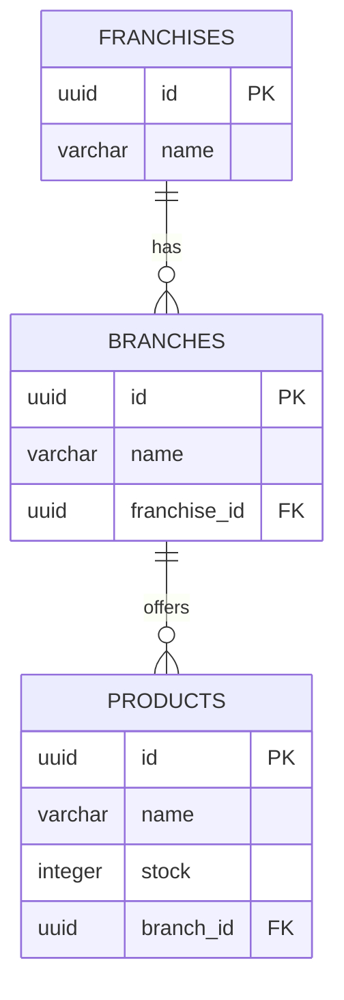

# Base de datos - franchise-api

Modelo relacional para Supabase (Postgres): una franquicia tiene muchas sucursales, y cada
sucursal tiene muchos productos.

## Diagrama entidad-relacion

## Archivos

| Archivo | Contenido |
|---|---|
| [schema.sql](./schema.sql) | `CREATE TABLE` de `franchises`, `branches` y `products`, con sus llaves foraneas, el `CHECK (stock >= 0)` y los indices usados por el endpoint de top-stock. |
| [seed.sql](./seed.sql) | `INSERT` de datos de ejemplo (2 franquicias, 3 sucursales, 7 productos) listos para probar la API. |

## Como usarlos en Supabase

1. Entra a tu proyecto de Supabase → **SQL Editor** → *New query*.
2. Pega el contenido de `schema.sql` y ejecutalo (crea las tablas si no existen).
3. Opcionalmente, pega `seed.sql` y ejecutalo para tener datos de prueba.
4. Configura `DB_URL`, `DB_USERNAME` y `DB_PASSWORD` en tu `.env` (ver el README raiz del
   proyecto) apuntando a ese mismo proyecto de Supabase.

Estos scripts son **opcionales**: si no los ejecutas, la aplicacion crea/actualiza las mismas
tablas automaticamente al arrancar (`spring.jpa.hibernate.ddl-auto=update`), pero sin el
`CHECK` de stock ni los indices adicionales que sí definen estos scripts.

## Notas de diseno

- Los `id` son `UUID` (`gen_random_uuid()`), igual que las entidades JPA (`GenerationType.UUID`).
- `branches.franchise_id` y `products.branch_id` tienen `ON DELETE CASCADE`: borrar una
  franquicia borra sus sucursales y productos (refleja `cascade = CascadeType.ALL,
  orphanRemoval = true` en las entidades `Franchise`/`Branch`).
- El indice compuesto `products(branch_id, stock desc)` favorece la consulta usada por
  `GET /api/franchises/{id}/top-stock-products` (producto con mas stock por sucursal).
